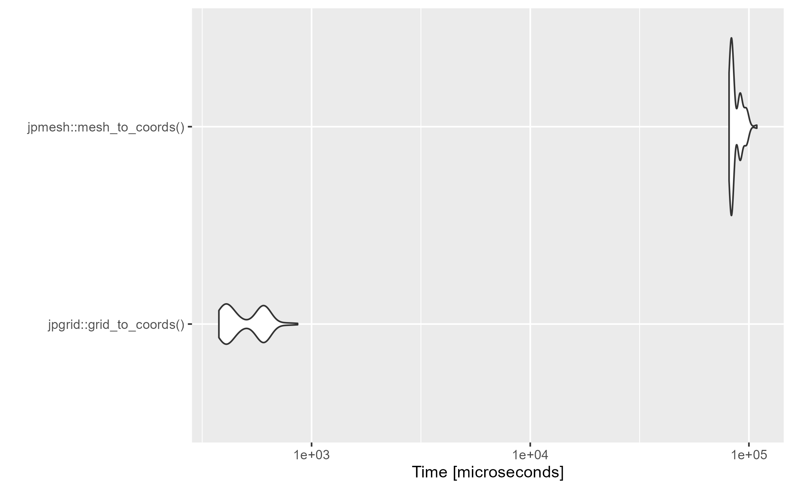

<!-- README.md is generated from README.Rmd. Please edit that file -->

```{r, include = FALSE}
knitr::opts_chunk$set(
  collapse = TRUE,
  comment = "#>",
  fig.path = "man/figures/README-",
  out.width = "100%",
  warning = FALSE
)
```

# jpgrid <a href="https://uchidamizuki.github.io/jpgrid/"></a>

<!-- badges: start -->

[](https://CRAN.R-project.org/package=jpgrid) [](https://github.com/UchidaMizuki/jpgrid/actions/workflows/R-CMD-check.yaml) [](https://app.codecov.io/gh/UchidaMizuki/jpgrid?branch=main)

<!-- badges: end -->

jpgrid is an R package for using the JIS (Japan Industrial Standard) X 0410 '[Grid Square Code](https://www.jisc.go.jp/app/jis/general/GnrJISNumberNameSearchList?show&jisStdNo=X0410)'.
grid square codes are square-like regional divisions set up for all regions of Japan based on longitude and latitude.
For more information, please check [the Statistics Bureau of Japan page](https://www.stat.go.jp/data/mesh/pdf/gaiyo1.pdf).

A summary of the grid square codes is shown below.
In jpgrid, each code is distinguished by the length of a piece of grid, such as `grid_80km`.

```{r,echo=FALSE}
df <- tibble::tibble(`Name` = c("1st grid", "2nd grid", "3rd grid", "1/2 grid", "1/4 grid", "1/8 grid", "1/10 subdivision of the 3rd grid"),
                     `Edge length` = c("Abount 80km", "Abount 10km", "Abount 1km", "Abount 500m", "Abount 250m", "Abount 125m", "Abount 100m"),
                     `Number of digits` = c(4, 6, 8, 9, 10, 11, 10))
knitr::kable(df)
```

jpgrid has been developed to enable faster processing than the R package [jpmesh](https://github.com/uribo/jpmesh).
The main differences between jpgrid and jpmesh are as follows

1.  Explicitly given a grid size (such as `grid_80km`).
2.  Non-land (ocean) grids are supported.
3.  It can extract nth-order neighboring grids and perform complex operations such as extracting grids and calculating the distance of (line) paths between grids.

## Installation

You can install jpgrid from CRAN.

``` r
install.packages("jpgrid")
```

You can also install the development version from GitHub.

``` r
# install.packages("devtools")
devtools::install_github("UchidaMizuki/jpgrid")
```

## Usage

```{r,message=FALSE}
library(jpgrid)
library(tidyverse)

JGD2011 <- 6668
```

### Conversion of geometry to grid square codes

`geometry_to_grid()` can be used to convert `sf` objects to the grid square codes.
You can also use `grid_as_sf()` to convert data containing grid square codes (of class `grid`) into an `sf` object.

```{r,message=FALSE}
geom_chiba <- rnaturalearth::ne_states(country = "japan",
                                       returnclass = "sf") |> 
  filter(name == "Chiba")
grid_chiba <- geometry_to_grid(geom_chiba, "10km") |> 
  first() |> 
  grid_as_sf(crs = sf::st_crs(geom_chiba))

grid_chiba |> 
  ggplot() +
  geom_sf(data = geom_chiba) +
  geom_sf(fill = "transparent") +
  geom_sf_text(aes(label = as.character(grid)),
               size = 2)
```

`grid_city_2020` contains 1 km grid square codes for each municipality in Japan.

```{r}
grid_city_2020 |> 
  filter(str_starts(city_code, "121")) |> 
  grid_as_sf(crs = JGD2011) |> 
  ggplot(aes(fill = as_factor(city_name_ja))) +
  geom_sf() +
  scale_fill_brewer("City",
                    palette = "Set2")
```

### Generation of grid square codes from character strings or numbers

Use `parse_grid()` to generate grid square codes from strings or numbers.

-   Specify the grid size as `grid_size = "80km"`.
    -   If `grid_size = NULL`, the grid size is automatically determined.
-   The default (`strict = TRUE`) requires the grid square codes to have a given number of digits.

```{r}
x <- c("53394526313", "5339358633", "533945764", "53394611", "523503", "5339", NA)

parse_grid(x, grid_size = "80km")
parse_grid(x, grid_size = "125m")
parse_grid(x)

parse_grid(x, "80km",
           strict = FALSE)
parse_grid(x, "125m",
           strict = FALSE)
parse_grid(x, 
           strict = FALSE)
```

### Converting the grid size of grid square codes

Use `grid_convert()` to coarsen the grid size of grid square codes.
The `grid_subdivide()` function can be used to subdivide grid square codes.

-   `grid_subdivide()` outputs a list of grid square codes whose elements are contained in the original grids.
-   The conversion between 500m grid and 100m grid is supported.

```{r}
grid_500m <- parse_grid("533945764", "500m")

grid_convert(grid_500m, "1km")

grid_100m <- grid_subdivide(grid_500m, "100m")
grid_100m

tibble(grid_100m = grid_100m[[1]]) |> 
  grid_as_sf(crs = JGD2011) |>  
  ggplot() +
  geom_sf() +
  geom_sf_text(aes(label = as.character(grid_100m)))
```

### Conversion from longitude/latitude to grid square codes

The `coords_to_grid()` converts longitude and latitude to grid square codes.

```{r}
tibble(X = c(139.7008, 135.4375), # longitude
       Y = c(35.68906, 34.70833)) |> # latitude
  mutate(grid_100m = coords_to_grid(X, Y, "100m"),
         grid_125m = coords_to_grid(X, Y, "125m")) |> 
  knitr::kable()
```

### Conversion from grid square codes to longitude/latitude

The `grid_to_coords()` function converts grid square codes to longitude and latitude.

```{r}
tibble(grid = parse_grid(c("5339452660", "5235034590"), "100m")) |> 
  mutate(grid_to_coords(grid)) |> 
  knitr::kable()
```

### Calculation of adjacent grid square codes

The `grid_neighborhood()` function calculates the neighboring grids.

-   nth order neighboring grids can be calculated by specifying `n`.
-   You can specify a Neumann neighborhood with `type = "von_neumann"` and a Moore neighborhood with `type = "moore"`.

```{r}
neighborhood <- parse_grid("644142", "10km") |> 
  grid_neighborhood(n = c(0:2),
                    type = "von_neumann",
                    simplify = FALSE)

neighborhood[[1]] |> 
  grid_as_sf(crs = JGD2011) |> 
  
  ggplot(aes(fill = as.factor(n))) +
  geom_sf() +
  geom_sf_text(aes(label = as.character(grid_neighborhood)))
```

```{r}
neighborhood <- parse_grid("644142", "10km") |> 
  grid_neighborhood(n = c(0:2),
                    type = "moore",
                    simplify = FALSE)

neighborhood[[1]] |> 
  grid_as_sf(crs = JGD2011) |> 
  ggplot(aes(fill = as.factor(n))) +
  geom_sf() +
  geom_sf_text(aes(label = as.character(grid_neighborhood)))
```

### Get the connected components of grid square codes

`grid_components()` calculates the connected components of grid square codes and returns the cluster ID.

-   You can specify `n` and `type` as in the `grid_neighborhood()`.

```{r}
set.seed(1234)

grid_city_2020 |> 
  filter(str_starts(city_code, "121")) |> 
  slice_sample(prop = 0.5) |> 
  mutate(cluster = grid_components(grid,
                                   type = "von_neumann")) |> 
  grid_as_sf(crs = JGD2011) |> 
  ggplot(aes(fill = fct_shuffle(as_factor(cluster)))) +
  geom_sf(show.legend = FALSE) 
```

### Draw line segments between grids

The `grid_line()` function extracts grids that lie on the line segments between grids.

```{r}
grid_from <- parse_grid(c("6441", "5339"), "80km")
grid_to <- parse_grid(c("5237", "5235"), "80km")

line <- grid_line(grid_from, grid_to)

tibble::tibble(grid = line[[1]]) |> 
  grid_as_sf(crs = JGD2011) |> 
  ggplot() +
  geom_sf() +
  geom_sf_text(aes(label = as.character(grid)))
```

It can handle the case of passing through multiple grids by giving a `list` of grids.

-   Close the line segment with `close = TRUE`.
-   `skip_na = TRUE` to skip `NA`.

```{r}
grid_1 <- parse_grid(c("6441", "5339", NA, "5250"), "80km")
grid_2 <- parse_grid(c("6439", "5211", "4013", "6635"), "80km")

line <- grid_line(list(grid_1, grid_2), 
                  close = TRUE,
                  skip_na = TRUE)

tibble::tibble(grid = line[[1]]) |> 
  grid_as_sf(crs = JGD2011) |> 
  ggplot() +
  geom_sf() +
  geom_sf_text(aes(label = as.character(grid)))
```

### Calculation of distance between grids

The `grid_distance()` function calculates the distance between grids (great circle distance).

-   As with `grid_line()`, the path distance can be calculated by `list` of grids.

```{r}
grid_from <- parse_grid(c("6441", "5339"), "80km")
grid_to <- parse_grid(c("5237", "5235"), "80km")

distance <- grid_distance(grid_from, grid_to)

print(distance)
```

### Others

-   `grid_move()` function can be used to calculate the grid square code in the east-west and north-south directions.
-   For grid outside the range of the 80 km grid, where the digits are negative or exceed three digits, the relevant code is displayed as `<-1>` or `<123>` to clearly distinguish them from existing grids.

## Comparison of processing speed with jpmesh package

The conversion speed between grids and latitude/longitude in this package is several tens to several hundred times faster than in the jpmesh package.

```{r,echo=FALSE,eval=FALSE}
X <- runif(1e1, 139, 140)
Y <- runif(1e1, 39, 40)

microbenchmark::microbenchmark(`jpgrid::coords_to_grid()` = coords_to_grid(X, Y, "1km"),
                               `jpmesh::coords_to_mesh()` = jpmesh::coords_to_mesh(X, Y,
                                                                                   mesh_size = 1),
                               setup = set.seed(1234)) |> 
  autoplot()
```

```{r,echo=FALSE,eval=FALSE}
X <- runif(1e1, 139, 140)
Y <- runif(1e1, 39, 40)
grid_jpgrid <- coords_to_grid(X, Y, "1km")
mesh_jpmesh <- jpmesh::coords_to_mesh(X, Y, 
                                      mesh_size = 1)

microbenchmark::microbenchmark(`jpgrid::grid_to_coords()` = grid_to_coords(grid_jpgrid),
                               `jpmesh::mesh_to_coords()` = jpmesh::mesh_to_coords(mesh_jpmesh),
                               setup = set.seed(1234)) |> 
  autoplot()
```



