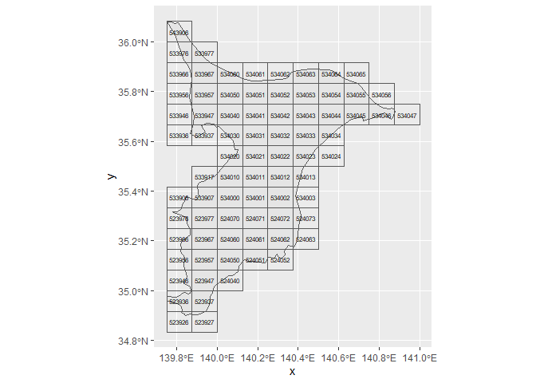
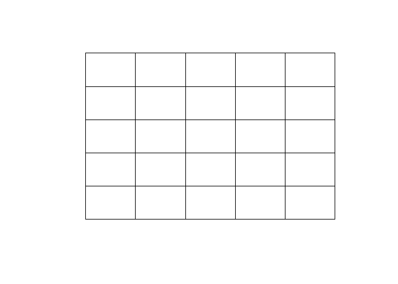
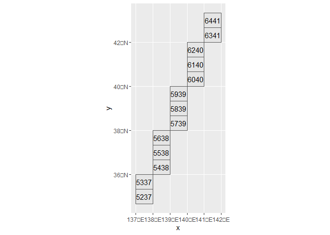
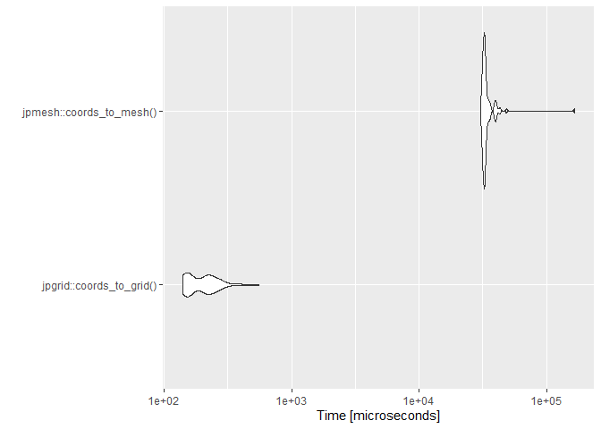
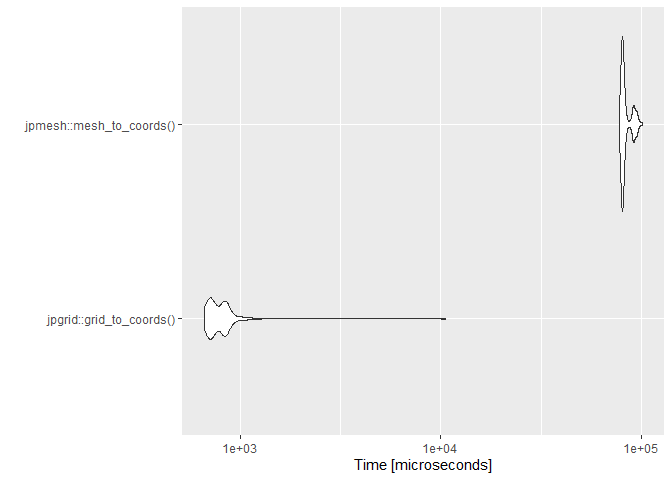

<!-- README.md is generated from README.Rmd. Please edit that file -->

# jpgrid <a href="https://uchidamizuki.github.io/jpgrid/"></a>

<!-- badges: start -->

[](https://CRAN.R-project.org/package=jpgrid)
<!-- badges: end -->

jpgrid is an R package for using the JIS (Japan Industrial Standard) X
0410 ‘[Grid Square
Code](https://www.jisc.go.jp/app/jis/general/GnrJISNumberNameSearchList?show&jisStdNo=X0410)’.
grid square codes are square-like regional divisions set up for all
regions of Japan based on longitude and latitude. For more information,
please check [the Statistics Bureau of Japan
page](https://www.stat.go.jp/data/mesh/pdf/gaiyo1.pdf).

A summary of the grid square codes is shown below. In jpgrid, each code
is distinguished by the length of a piece of grid, such as `grid_80km`.

| Name                             | Edge length | Number of digits |
|:---------------------------------|:------------|-----------------:|
| 1st grid                         | Abount 80km |                4 |
| 2nd grid                         | Abount 10km |                6 |
| 3rd grid                         | Abount 1km  |                8 |
| 1/2 grid                         | Abount 500m |                9 |
| 1/4 grid                         | Abount 250m |               10 |
| 1/8 grid                         | Abount 125m |               11 |
| 1/10 subdivision of the 3rd grid | Abount 100m |               10 |

jpgrid has been developed to enable faster processing than the R package
[jpmesh](https://github.com/uribo/jpmesh). The main differences between
jpgrid and jpmesh are as follows

1.  Explicitly given a grid size (such as `grid_80km`).
2.  Non-land (ocean) grids are supported.
3.  It can extract nth-order neighboring grids and perform complex
    operations such as extracting grids and calculating the distance of
    (line) paths between grids.

## Installation

You can install jpgrid from CRAN.

``` r
install.packages("jpgrid")
```

You can also install the development version from GitHub.

``` r
# install.packages("devtools")
devtools::install_github("UchidaMizuki/jpgrid")
```

## Usage

``` r
library(jpgrid)
library(tidyverse)

JGD2011 <- 6668
```

### Conversion of geometry to grid square codes

`geometry_to_grid()` can be used to convert `sf` objects to the grid
square codes. You can also use `grid_as_sf()` to convert data containing
grid square codes (of class `grid`) into an `sf` object.

``` r
geom_chiba <- rnaturalearth::ne_states(country = "japan",
                                       returnclass = "sf") |> 
  filter(name == "Chiba")
grid_chiba <- geometry_to_grid(geom_chiba, "10km") |> 
  first() |> 
  grid_as_sf(crs = sf::st_crs(geom_chiba))

grid_chiba |> 
  ggplot() +
  geom_sf(data = geom_chiba) +
  geom_sf(fill = "transparent") +
  geom_sf_text(aes(label = as.character(grid)),
               size = 2)
#> Warning in st_point_on_surface.sfc(sf::st_zm(x)): st_point_on_surface may not
#> give correct results for longitude/latitude data
```



`grid_city` contains 1 km grid square codes for each municipality in
Japan.

``` r
grid_city |> 
  filter(str_starts(city_code, "121")) |> 
  grid_as_sf(crs = JGD2011) |> 
  ggplot(aes(fill = as_factor(city_name_ja))) +
  geom_sf() +
  scale_fill_brewer("City",
                    palette = "Set2")
```


### Generation of grid square codes from character strings or numbers

Use `parse_grid()` to generate grid square codes from strings or
numbers.

- Specify the grid size as `grid_size = "80km"`.
  - If `grid_size = NULL`, the grid size is automatically determined.
- The default (`strict = TRUE`) requires the grid square codes to have a
  given number of digits.

``` r
x <- c("53394526313", "5339358633", "533945764", "53394611", "523503", "5339", NA)

parse_grid(x, grid_size = "80km")
#> <grid_80km[7]>
#> [1] <NA> <NA> <NA> <NA> <NA> 5339 <NA>
parse_grid(x, grid_size = "125m")
#> <grid_125m[7]>
#> [1] 53394526313 <NA>        <NA>        <NA>        <NA>        <NA>       
#> [7] <NA>
parse_grid(x)
#> Guessing, grid_size = "80km"
#> <grid_80km[7]>
#> [1] <NA> <NA> <NA> <NA> <NA> 5339 <NA>

parse_grid(x, "80km",
           strict = FALSE)
#> <grid_80km[7]>
#> [1] 5339 5339 5339 5339 5235 5339 <NA>
parse_grid(x, "125m",
           strict = FALSE)
#> <grid_125m[7]>
#> [1] 53394526313 <NA>        <NA>        <NA>        <NA>        <NA>       
#> [7] <NA>
parse_grid(x, 
           strict = FALSE)
#> Guessing, grid_size = "80km"
#> <grid_80km[7]>
#> [1] 5339 5339 5339 5339 5235 5339 <NA>
```

### Converting the grid size of grid square codes

Use `grid_convert()` to coarsen the grid size of grid square codes. The
`grid_subdivide()` function can be used to subdivide grid square codes.

- `grid_subdivide()` outputs a list of grid square codes whose elements
  are contained in the original grids.
- The conversion between 500m grid and 100m grid is supported.

``` r
grid_500m <- parse_grid("533945764", "500m")

grid_convert(grid_500m, "1km")
#> <grid_1km[1]>
#> [1] 53394576

grid_100m <- grid_subdivide(grid_500m, "100m")
grid_100m
#> [[1]]
#> <grid_100m[25]>
#>  [1] 5339457655 5339457665 5339457675 5339457685 5339457695 5339457656
#>  [7] 5339457666 5339457676 5339457686 5339457696 5339457657 5339457667
#> [13] 5339457677 5339457687 5339457697 5339457658 5339457668 5339457678
#> [19] 5339457688 5339457698 5339457659 5339457669 5339457679 5339457689
#> [25] 5339457699

tibble(grid_100m = grid_100m[[1]]) |> 
  grid_as_sf(crs = JGD2011) |>  
  ggplot() +
  geom_sf() +
  geom_sf_text(aes(label = as.character(grid_100m)))
#> Warning in st_point_on_surface.sfc(sf::st_zm(x)): st_point_on_surface may not
#> give correct results for longitude/latitude data
```



### Conversion from longitude/latitude to grid square codes

The `coords_to_grid()` converts longitude and latitude to grid square
codes.

``` r
tibble(X = c(139.7008, 135.4375), # longitude
       Y = c(35.68906, 34.70833)) |> # latitude
  mutate(grid_100m = coords_to_grid(X, Y, "100m"),
         grid_125m = coords_to_grid(X, Y, "125m")) |> 
  knitr::kable()
```

|        X |        Y | grid_100m  | grid_125m   |
|---------:|---------:|:-----------|:------------|
| 139.7008 | 35.68906 | 5339452660 | 53394526313 |
| 135.4375 | 34.70833 | 5235034499 | 52350344444 |

### Conversion from grid square codes to longitude/latitude

The `grid_to_coords()` function converts grid square codes to longitude
and latitude.

``` r
tibble(grid = grid_100m(c("5339452660", "5235034590"))) |> 
  mutate(grid_to_coords(grid)) |> 
  knitr::kable()
#> Warning: `grid_100m()` was deprecated in jpgrid 0.4.0.
#> ℹ Please use `parse_grid()` or `grid_convert()`
#> ℹ The deprecated feature was likely used in the jpgrid package.
#>   Please report the issue at <]8;;https://github.com/UchidaMizuki/jpgrid/issueshttps://github.com/UchidaMizuki/jpgrid/issues]8;;>.
```

| grid       |        X |        Y |
|:-----------|---------:|---------:|
| 5339452660 | 139.7006 | 35.68875 |
| 5235034590 | 135.4381 | 34.70792 |

### Calculation of adjacent grid square codes

The `grid_neighbor()` function calculates the neighboring grids.

- nth order neighboring grids can be calculated by specifying `n`.
- Can be calculated in a Neumann neighborhood with `moore = FALSE`.

``` r
neighbor <- parse_grid("644142", "10km") |> 
  grid_neighbor(n = c(0:2),
                simplify = FALSE)

neighbor[[1]] |> 
  grid_as_sf(crs = JGD2011) |> 
  
  ggplot(aes(fill = as.factor(n))) +
  geom_sf() +
  geom_sf_text(aes(label = as.character(grid_neighbor)))
#> Warning in st_point_on_surface.sfc(sf::st_zm(x)): st_point_on_surface may not
#> give correct results for longitude/latitude data

#> Warning in st_point_on_surface.sfc(sf::st_zm(x)): st_point_on_surface may not
#> give correct results for longitude/latitude data

#> Warning in st_point_on_surface.sfc(sf::st_zm(x)): st_point_on_surface may not
#> give correct results for longitude/latitude data
```


``` r
neighbor_neumann <- parse_grid("644142", "10km") |> 
  grid_neighbor(n = c(0:2),
                simplify = F,
                moore = F)

neighbor_neumann[[1]] |> 
  grid_as_sf(crs = JGD2011) |> 
  ggplot(aes(fill = as.factor(n))) +
  geom_sf() +
  geom_sf_text(aes(label = as.character(grid_neighbor)))
#> Warning in st_point_on_surface.sfc(sf::st_zm(x)): st_point_on_surface may not
#> give correct results for longitude/latitude data

#> Warning in st_point_on_surface.sfc(sf::st_zm(x)): st_point_on_surface may not
#> give correct results for longitude/latitude data

#> Warning in st_point_on_surface.sfc(sf::st_zm(x)): st_point_on_surface may not
#> give correct results for longitude/latitude data
```


### Draw line segments between grids

The `grid_line()` function extracts grids that lie on the line segments
between grids.

``` r
grid_from <- parse_grid(c("6441", "5339"), "80km")
grid_to <- parse_grid(c("5237", "5235"), "80km")

line <- grid_line(grid_from, grid_to)

tibble::tibble(grid = line[[1]]) |> 
  grid_as_sf(crs = JGD2011) |> 
  ggplot() +
  geom_sf() +
  geom_sf_text(aes(label = as.character(grid)))
#> Warning in st_point_on_surface.sfc(sf::st_zm(x)): st_point_on_surface may not
#> give correct results for longitude/latitude data
```



It can handle the case of passing through multiple grids by giving a
`list` of grids.

- Close the line segment with `close = TRUE`.
- `skip_na = TRUE` to skip `NA`.

``` r
grid_1 <- parse_grid(c("6441", "5339", NA, "5250"), "80km")
grid_2 <- parse_grid(c("6439", "5211", "4013", "6635"), "80km")

line <- grid_line(list(grid_1, grid_2), 
                  close = TRUE,
                  skip_na = TRUE)

tibble::tibble(grid = line[[1]]) |> 
  grid_as_sf(crs = JGD2011) |> 
  ggplot() +
  geom_sf() +
  geom_sf_text(aes(label = as.character(grid)))
#> Warning in st_point_on_surface.sfc(sf::st_zm(x)): st_point_on_surface may not
#> give correct results for longitude/latitude data
```


### Calculation of distance between grids

The `grid_distance()` function calculates the distance between grids
(great circle distance).

- As with `grid_line()`, the path distance can be calculated by `list`
  of grids.

``` r
grid_from <- parse_grid(c("6441", "5339"), "80km")
grid_to <- parse_grid(c("5237", "5235"), "80km")

distance <- grid_distance(grid_from, grid_to)

print(distance)
#> Units: [m]
#> [1] 953014.2 371081.9
```

### Others

- `grid_move()` function can be used to calculate the grid square code
  in the east-west and north-south directions.
- For grid outside the range of the 80 km grid, where the digits are
  negative or exceed three digits, the relevant code is displayed as
  `<-1>` or `<123>` to clearly distinguish them from existing grids.

## Comparison of processing speed with jpmesh package

The conversion speed between grids and latitude/longitude in this
package is several tens to several hundred times faster than in the
jpmesh package.




