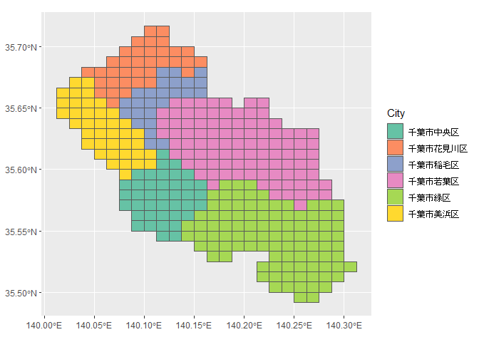
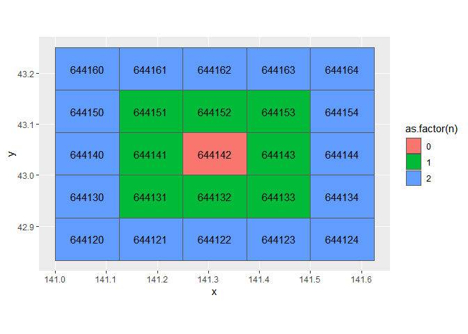
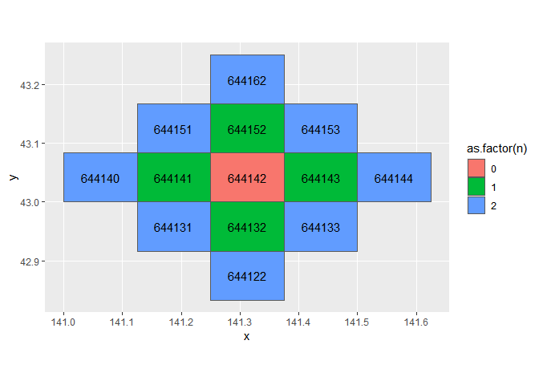
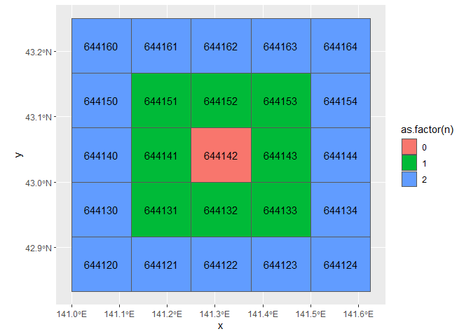
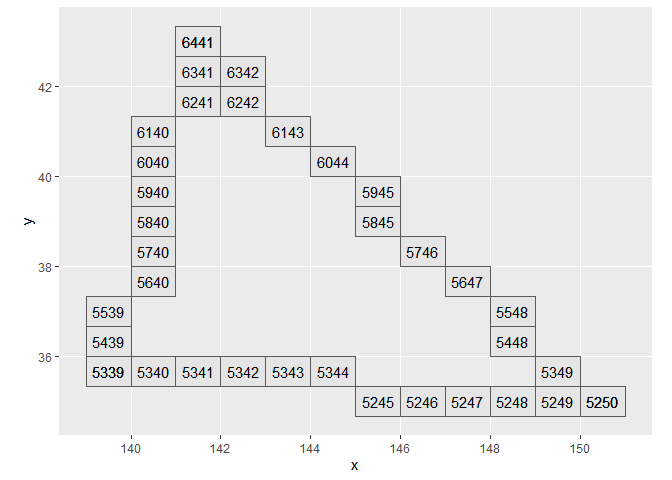
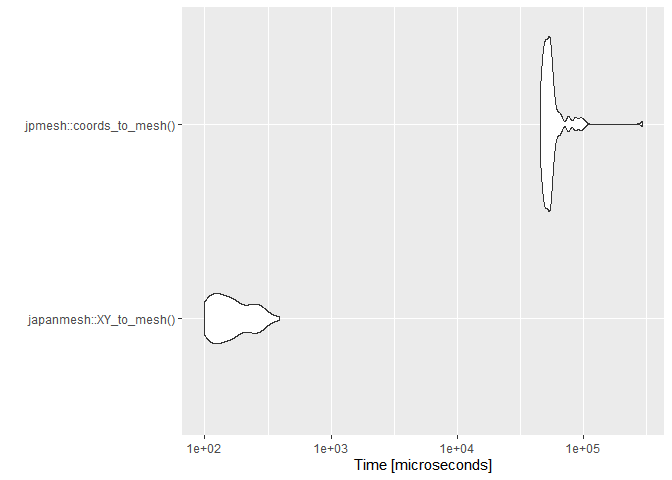
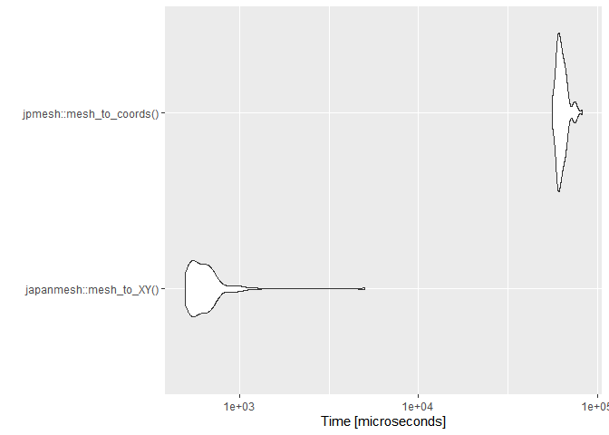

<!-- README.md is generated from README.Rmd. Please edit that file -->

# jpgrid

<!-- badges: start -->

[](https://CRAN.R-project.org/package=jpgrid)
<!-- badges: end -->

jpgrid is an R package for using the reference regional mesh (the 1st
mesh to the 3rd mesh), the split regional mesh as defined by the JIS
(Japan Industrial Standard) X 0410 ‘[regional mesh
code](https://www.jisc.go.jp/app/jis/general/GnrJISNumberNameSearchList?show&jisStdNo=X0410)’
and 1/10 subdivision of the 3rd mesh. Regional mesh codes are
square-like regional divisions set up for all regions of Japan based on
longitude and latitude. For more information on regional meshes, please
check [the Statistics Bureau of Japan
page](https://www.stat.go.jp/data/mesh/pdf/gaiyo1.pdf).

A summary of the regional mesh codes is shown below. In jpgrid, each
regional mesh code is distinguished by the length of a piece of mesh,
such as `grid_80km`.

| Name                             | Edge length | Number of digits |
|:---------------------------------|:------------|-----------------:|
| 1st mesh                         | Abount 80km |                4 |
| 2nd mesh                         | Abount 10km |                6 |
| 3rd mesh                         | Abount 1km  |                8 |
| 1/2 mesh                         | Abount 500m |                9 |
| 1/4 mesh                         | Abount 250m |               10 |
| 1/8 mesh                         | Abount 125m |               11 |
| 1/10 subdivision of the 3rd mesh | Abount 100m |               10 |

jpgrid has been developed to enable faster processing than the R package
[jpmesh](https://github.com/uribo/jpmesh). The main differences between
jpgrid and jpmesh are as follows

1.  Explicitly given a mesh size (such as `grid_80km`).
2.  Non-land (ocean) meshes are supported.
3.  It can extract nth-order neighboring meshes and perform complex
    operations such as extracting meshes and calculating the distance of
    (line) paths between meshes.

## Installation

You can install jpgrid from CRAN.

``` r
install.packages("jpgrid")
```

You can also install the development version from GitHub.

``` r
# install.packages("devtools")
devtools::install_github("UchidaMizuki/jpgrid")
```

## Usage

``` r
library(jpgrid)

library(tibble)
library(dplyr)
library(ggplot2)
```

### Generation of regional mesh codes from character strings or numbers

Use functions such as `grid_80km()`, `grid_auto()`, etc. to generate
regional mesh codes from strings or numbers.

-   The `grid_auto()` function automatically determines the mesh size.
-   The default (`strict = TRUE`) requires the mesh codes to have a
    given number of digits.

``` r
library(jpgrid)

x <- c("53394526313", "5339358633", "533945764", "53394611", "523503", "5339", NA)

grid_80km(x)
#> <grid_80km[7]>
#> [1] <NA> <NA> <NA> <NA> <NA> 5339 <NA>
grid_125m(x)
#> <grid_125m[7]>
#> [1] 53394526313 <NA>        <NA>        <NA>        <NA>        <NA>       
#> [7] <NA>
grid_auto(x)
#> Guessing grid size as `80km`
#> <grid_80km[7]>
#> [1] <NA> <NA> <NA> <NA> <NA> 5339 <NA>

grid_80km(x, strict = FALSE)
#> <grid_80km[7]>
#> [1] 5339 5339 5339 5339 5235 5339 <NA>
grid_125m(x, strict = FALSE)
#> <grid_125m[7]>
#> [1] 53394526313 <NA>        <NA>        <NA>        <NA>        <NA>       
#> [7] <NA>
grid_auto(x, strict = FALSE)
#> Guessing grid size as `80km`
#> <grid_80km[7]>
#> [1] 5339 5339 5339 5339 5235 5339 <NA>
```

### Converting the mesh size of regional mesh codes

Use functions such as `grid_80km()` to coarsen the mesh size of regional
mesh codes. The `grid_subdivide()` function can be used to subdivide
regional mesh codes.

-   `grid_subdivide()` outputs a list of mesh codes whose elements are
    contained in the original meshes.
-   The conversion between 500m mesh and 100m mesh is supported.

``` r
grid500m <- grid_500m("533945764")

grid_1km(grid500m)
#> <grid_1km[1]>
#> [1] 53394576

grid100m <- grid_subdivide(grid500m,
                           size = "100m")
grid100m
#> [[1]]
#> <grid_100m[25]>
#>  [1] 5339457655 5339457665 5339457675 5339457685 5339457695 5339457656
#>  [7] 5339457666 5339457676 5339457686 5339457696 5339457657 5339457667
#> [13] 5339457677 5339457687 5339457697 5339457658 5339457668 5339457678
#> [19] 5339457688 5339457698 5339457659 5339457669 5339457679 5339457689
#> [25] 5339457699

tibble(grid100m = grid100m[[1]]) %>% 
  sf::st_set_geometry(sf::st_as_sfc(.$grid100m)) %>% 
  ggplot() +
  geom_sf() +
  geom_sf_text(aes(label = grid100m))
#> Don't know how to automatically pick scale for object of type grid_100m/grid/vctrs_rcrd/vctrs_vctr. Defaulting to continuous.
```



### Conversion from longitude/latitude to regional mesh codes

The `XY_to_grid()` function converts longitude and latitude to regional
mesh codes.

``` r
tibble(X = c(139.7008, 135.4375), # longitude
       Y = c(35.68906, 34.70833)) %>% # latitude
  mutate(grid100m = XY_to_grid(X, Y, size = "100m"),
         mesh125m = XY_to_grid(X, Y, size = "125m")) %>% 
  knitr::kable()
```

|        X |        Y | grid100m   | mesh125m    |
|---------:|---------:|:-----------|:------------|
| 139.7008 | 35.68906 | 5339452660 | 53394526313 |
| 135.4375 | 34.70833 | 5235034499 | 52350344444 |

### Conversion from regional mesh codes to longitude/latitude

The `grid_to_XY()` function converts regional mesh codes to longitude
and latitude.

``` r
tibble(mesh = grid_100m(c("5339452660", "5235034590"))) %>% 
  mutate(grid_to_XY(mesh)) %>% 
  knitr::kable()
```

| mesh       |        X |        Y |
|:-----------|---------:|---------:|
| 5339452660 | 139.7006 | 35.68875 |
| 5235034590 | 135.4381 | 34.70792 |

### Calculation of adjacent mesh codes

The `grid_neighbor()` function calculates the neighboring meshes.

-   nth order neighboring meshes can be calculated by specifying `n`.
-   Can be calculated in a Neumann neighborhood with `moore = FALSE`.

``` r
neighbor <- grid_10km("644142") %>% 
  grid_neighbor(n = c(0:2),
                simplify = FALSE)

neighbor[[1]] %>% 
  sf::st_set_geometry(sf::st_as_sfc(.$grid_neighbor)) %>% 
  
  ggplot(aes(fill = as.factor(n))) +
  geom_sf() +
  geom_sf_text(aes(label = grid_neighbor))
#> Don't know how to automatically pick scale for object of type grid_10km/grid/vctrs_rcrd/vctrs_vctr. Defaulting to continuous.
```



``` r
neighbor_neumann <- grid_10km("644142") %>% 
  grid_neighbor(n = c(0:2),
                simplify = F,
                moore = F)

neighbor_neumann[[1]] %>% 
  sf::st_set_geometry(sf::st_as_sfc(.$grid_neighbor)) %>% 
  
  ggplot(aes(fill = as.factor(n))) +
  geom_sf() +
  geom_sf_text(aes(label = grid_neighbor))
#> Don't know how to automatically pick scale for object of type grid_10km/grid/vctrs_rcrd/vctrs_vctr. Defaulting to continuous.
```



### Draw line segments between meshes

The `grid_line()` function extracts meshes that lie on the line segments
between meshes.

``` r
grid_from <- grid_80km(c("6441", "5339"))
grid_to <- grid_80km(c("5237", "5235"))

line <- grid_line(grid_from, grid_to)

tibble::tibble(grid = line[[1]]) %>% 
  sf::st_set_geometry(sf::st_as_sfc(.$grid)) %>% 
  ggplot() +
  geom_sf() +
  geom_sf_text(aes(label = grid))
#> Don't know how to automatically pick scale for object of type grid_80km/grid/vctrs_rcrd/vctrs_vctr. Defaulting to continuous.
```



It can handle the case of passing through multiple meshes by giving a
`list` of meshes.

-   Close the line segment with `close = TRUE`.
-   `skip_na = TRUE` to skip `NA`.

``` r
grid_1 <- grid_80km(c("6441", "5339", NA, "5250"))
grid_2 <- grid_80km(c("6439", "5211", "4013", "6635"))

line <- grid_line(list(grid_1, grid_2), 
                  close = TRUE,
                  skip_na = TRUE)

tibble::tibble(grid = line[[1]]) %>% 
  sf::st_set_geometry(sf::st_as_sfc(.$grid)) %>% 
  ggplot() +
  geom_sf() +
  geom_sf_text(aes(label = grid))
#> Don't know how to automatically pick scale for object of type grid_80km/grid/vctrs_rcrd/vctrs_vctr. Defaulting to continuous.
```



### Calculation of distance between meshes

The `grid_distance()` function calculates the distance between meshes
(great circle distance).

-   As with `grid_line()`, the path distance can be calculated by `list`
    of meshes.

``` r
grid_from <- grid_80km(c("6441", "5339"))
grid_to <- grid_80km(c("5237", "5235"))

distance <- grid_distance(grid_from, grid_to)

print(distance)
#> Units: [m]
#> [1] 953014.2 371081.9
```

### Others

-   `grid_move()` function can be used to calculate regional meshes in
    the east-west and north-south directions.
-   `sf::st_as_sfc` function can output `sfc` geometry.
-   For meshes outside the range of the 80 km mesh, where the digits are
    negative or exceed three digits, the relevant code is displayed as
    `<-1>` or `<123>` to clearly distinguish them from existing meshes.

## Comparison of processing speed with jpmesh package

The conversion speed between meshes and latitude/longitude in this
package is several tens to several hundred times faster than in the
jpmesh package.




