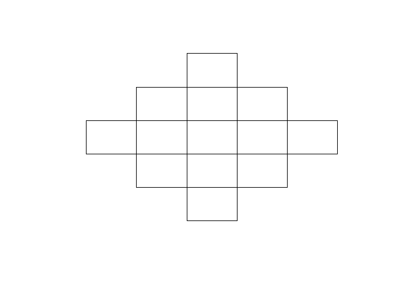

<!-- README.md is generated from README.Rmd. Please edit that file -->

## japanmesh

<!-- badges: start -->
<!-- badges: end -->

地域メッシュと経度・緯度との変換や異なるサイズの地域メッシュ間の変換などを行うためのRパッケージです．

### インストール方法

<!-- You can install the released version of japanmesh from [CRAN](https://CRAN.R-project.org) with: -->
<!-- ``` r -->
<!-- install.packages("japanmesh") -->
<!-- ``` -->
<!-- And the development version from [GitHub](https://github.com/) with: -->

CRANには登録されていないためGitHubからインストールしてください．

``` r
# install.packages("devtools")
devtools::install_github("UchidaMizuki/japanmesh")
```

### 使用方法

``` r
library(japanmesh)
library(tibble)
library(dplyr)
```

#### 文字列・数値からの地域メッシュの生成

文字列・数値から地域メッシュを生成するためには`mesh_***m()`，`mesh_auto()`関数を使用します．

-   `mesh_auto()`関数はメッシュサイズを自動的に決定します．
-   デフォルト（`strict = T`）では，メッシュコードの桁数が所定の桁数であることを要求します．

``` r
library(japanmesh)

x <- c("53394526313", "5339358633", "533945764", "53394611", "523503", "5339", NA)

mesh_80km(x)
#> <mesh_80km[7]>
#> [1] <NA> <NA> <NA> <NA> <NA> 5339 <NA>
mesh_125m(x)
#> <mesh_125m[7]>
#> [1] 53394526313 <NA>        <NA>        <NA>        <NA>        <NA>       
#> [7] <NA>
mesh_auto(x)
#> Guessing mesh size as `80km`
#> <mesh_80km[7]>
#> [1] <NA> <NA> <NA> <NA> <NA> 5339 <NA>

mesh_80km(x, strict = F)
#> <mesh_80km[7]>
#> [1] 5339 5339 5339 5339 5235 5339 <NA>
mesh_125m(x, strict = F)
#> <mesh_125m[7]>
#> [1] 53394526313 <NA>        <NA>        <NA>        <NA>        <NA>       
#> [7] <NA>
mesh_auto(x, strict = F)
#> Guessing mesh size as `80km`
#> <mesh_80km[7]>
#> [1] 5339 5339 5339 5339 5235 5339 <NA>
```

#### 地域メッシュのサイズの変換

`mesh_zoomin()`，`mesh_zoomout()`関数により，地域メッシュのサイズ変換・細分化を行います．

-   `mesh_zoomin()`は元のメッシュに含まれるメッシュを要素にもつリストを出力します．
-   100 mメッシュから500 mメッシュへの変換に対応．

``` r
mesh10km <- mesh_10km(x[1:2],
                      strict = F)

mesh_zoomout(mesh10km, 
             size = "80km")
#> <mesh_80km[2]>
#> [1] 5339 5339

zoomin <- mesh_zoomin(mesh10km,
                      size = "1km")
print(zoomin)
#> [[1]]
#> <mesh_1km[100]>
#>   [1] 53394500 53394510 53394520 53394530 53394540 53394550 53394560 53394570
#>   [9] 53394580 53394590 53394501 53394511 53394521 53394531 53394541 53394551
#>  [17] 53394561 53394571 53394581 53394591 53394502 53394512 53394522 53394532
#>  [25] 53394542 53394552 53394562 53394572 53394582 53394592 53394503 53394513
#>  [33] 53394523 53394533 53394543 53394553 53394563 53394573 53394583 53394593
#>  [41] 53394504 53394514 53394524 53394534 53394544 53394554 53394564 53394574
#>  [49] 53394584 53394594 53394505 53394515 53394525 53394535 53394545 53394555
#>  [57] 53394565 53394575 53394585 53394595 53394506 53394516 53394526 53394536
#>  [65] 53394546 53394556 53394566 53394576 53394586 53394596 53394507 53394517
#>  [73] 53394527 53394537 53394547 53394557 53394567 53394577 53394587 53394597
#>  [81] 53394508 53394518 53394528 53394538 53394548 53394558 53394568 53394578
#>  [89] 53394588 53394598 53394509 53394519 53394529 53394539 53394549 53394559
#>  [97] 53394569 53394579 53394589 53394599
#> 
#> [[2]]
#> <mesh_1km[100]>
#>   [1] 53393500 53393510 53393520 53393530 53393540 53393550 53393560 53393570
#>   [9] 53393580 53393590 53393501 53393511 53393521 53393531 53393541 53393551
#>  [17] 53393561 53393571 53393581 53393591 53393502 53393512 53393522 53393532
#>  [25] 53393542 53393552 53393562 53393572 53393582 53393592 53393503 53393513
#>  [33] 53393523 53393533 53393543 53393553 53393563 53393573 53393583 53393593
#>  [41] 53393504 53393514 53393524 53393534 53393544 53393554 53393564 53393574
#>  [49] 53393584 53393594 53393505 53393515 53393525 53393535 53393545 53393555
#>  [57] 53393565 53393575 53393585 53393595 53393506 53393516 53393526 53393536
#>  [65] 53393546 53393556 53393566 53393576 53393586 53393596 53393507 53393517
#>  [73] 53393527 53393537 53393547 53393557 53393567 53393577 53393587 53393597
#>  [81] 53393508 53393518 53393528 53393538 53393548 53393558 53393568 53393578
#>  [89] 53393588 53393598 53393509 53393519 53393529 53393539 53393549 53393559
#>  [97] 53393569 53393579 53393589 53393599
plot(zoomin[[1]])
```


#### 経度・緯度から地域メッシュへの変換

`XY_to_mesh()`関数は，経度・緯度を地域メッシュに変換します．

``` r
tibble(X = c(139.7008, 135.4375), # 経度
       Y = c(35.68906, 34.70833)) %>% # 緯度
  mutate(mesh100m = XY_to_mesh(X, Y, size = "100m"),
         mesh125m = XY_to_mesh(X, Y, size = "125m"))
#> # A tibble: 2 x 4
#>       X     Y   mesh100m    mesh125m
#>   <dbl> <dbl>   <msh100>    <msh125>
#> 1  140.  35.7 5339452660 53394526313
#> 2  135.  34.7 5235034499 52350344444
```

#### 地域メッシュから経度・緯度への変換

`mesh_to_XY()`関数は，地域メッシュを経度・緯度に変換します．

``` r
tibble(mesh = c("5339452660", "5235034590")) %>% 
  mutate(mesh %>% 
           mesh_100m() %>% 
           mesh_to_XY())
#> # A tibble: 2 x 3
#>   mesh           X     Y
#>   <chr>      <dbl> <dbl>
#> 1 5339452660  140.  35.7
#> 2 5235034590  135.  34.7
```

#### 隣接メッシュの算出

`mesh_neighbor()`関数は，隣接するメッシュを算出します．

-   `n`を指定することでn次隣接メッシュの算出が可能
-   `moore = F`でノイマン近傍での算出が可能

``` r
neighbor <- mesh_10km("644142") %>% 
  mesh_neighbor(n = c(2, 5))

print(neighbor)
#> [[1]]
#> <mesh_10km[56]>
#>  [1] 644120 644130 644140 644150 644160 644121 644161 644122 644162 644123
#> [11] 644163 644124 644134 644144 644154 644164 634075 644005 644015 644025
#> [21] 644035 644045 644055 644065 644075 654005 654015 634076 654016 634077
#> [31] 654017 634170 654110 634171 654111 634172 654112 634173 654113 634174
#> [41] 654114 634175 654115 634176 654116 634177 644107 644117 644127 644137
#> [51] 644147 644157 644167 644177 654107 654117
plot(neighbor[[1]])
```


``` r
neighbor_neumann <- mesh_10km("644142") %>% 
  mesh_neighbor(n = c(2, 5),
                moore = F)

print(neighbor_neumann)
#> [[1]]
#> <mesh_10km[28]>
#>  [1] 644140 644131 644151 644122 644162 644133 644153 644144 644045 644036
#> [11] 644056 644027 644067 644110 644170 644101 654101 634172 654112 644103
#> [21] 654103 644114 644174 644125 644165 644136 644156 644147
plot(neighbor_neumann[[1]])
```



#### メッシュ間の線分描画

`mesh_line()`関数により，メッシュ間の線分上に存在するメッシュを抽出します．

``` r
mesh_from <- mesh_80km(c("6441", "5339"))
mesh_to <- mesh_80km(c("5237", "5235"))

line <- mesh_line(mesh_from, mesh_to)

print(line)
#> [[1]]
#> <mesh_80km[13]>
#>  [1] 6441 6341 6240 6140 6040 5939 5839 5739 5638 5538 5438 5337 5237
#> 
#> [[2]]
#> <mesh_80km[5]>
#> [1] 5339 5338 5237 5236 5235
plot(line[[1]])
```


メッシュの`list`を与えることで複数メッシュを通る場合に対応可能です．

-   `close = T`で線分を閉じます．
-   `skip_na = T`で`NA`をスキップします．

``` r
mesh_1 <- mesh_80km(c("6441", "5339", NA, "5250"))
mesh_2 <- mesh_80km(c("6439", "5211", "4013", "6635"))

line <- mesh_line(list(mesh_1, mesh_2), 
                  close = T,
                  skip_na = T)

print(line)
#> [[1]]
#> <mesh_80km[37]>
#>  [1] 6441 6341 6241 6140 6040 5940 5840 5740 5640 5539 5439 5339 5339 5340 5341
#> [16] 5342 5343 5344 5245 5246 5247 5248 5249 5250 5250 5349 5448 5548 5647 5746
#> [31] 5845 5945 6044 6143 6242 6342 6441
#> 
#> [[2]]
#> <mesh_80km[74]>
#>  [1] 6439 6438 6337 6336 6235 6234 6133 6132 6131 6030 6029 5928 5927 5826 5825
#> [16] 5824 5723 5722 5621 5620 5519 5518 5517 5416 5415 5314 5313 5212 5211 5211
#> [31] 5111 5011 4912 4812 4712 4612 4512 4412 4313 4213 4113 4013 4013 4114 4215
#> [46] 4316 4416 4517 4618 4719 4820 4921 5021 5122 5223 5324 5425 5526 5627 5727
#> [61] 5828 5929 6030 6131 6232 6332 6433 6534 6635 6635 6536 6537 6438 6439
plot(line[[1]])
```


#### メッシュ間距離の算出

`mesh_distance()`関数は，メッシュ間距離（大円距離）を算出します．

-   `mesh_line()`と同様にメッシュの`list`で経路距離を算出可能です．

``` r
mesh_from <- mesh_80km(c("6441", "5339"))
mesh_to <- mesh_80km(c("5237", "5235"))

distance <- mesh_distance(mesh_from, mesh_to)

print(distance)
#> Units: [m]
#> [1] 953014.2 371081.9
```

#### その他

-   `mesh_move()`関数により，東西南北方向の地域メッシュを算出可能です．
-   `mesh_to_polygon()`関数および`mesh_to_point()`関数により`sfc`ジオメトリを出力可能です．
-   80kmメッシュの桁が負や三桁以上になる範囲外のメッシュについては，当該コードを`<-1>`，`<123>`のように表示し，既存メッシュと明確に区別できるようにしています．

### 他パッケージとの比較

地域メッシュを扱うRパッケージとして，本パッケージの他に`jpmesh`パッケージがあります．
本パッケージの`jpmesh`との優位点として，以下が挙げられます．

-   処理速度が`jpmesh`パッケージより速い場合があります．
-   `jpmesh::meshcode()`と違い，`as_mesh()`に`NA`を入力してもエラーを吐きません．

#### `jpmesh`パッケージとの処理速度の比較

以下の例では，本パッケージの計算速度は，`jpmesh`パッケージと比べて数百倍程度，高速です．

``` r
set.seed(1234)
df <- tibble(X = runif(1e3, 139, 140),
             Y = runif(1e3, 39, 40))

# XY to mesh
# jpmesh
tictoc::tic()
df_jpmesh <- df %>% 
  mutate(mesh = jpmesh::coords_to_mesh(X, Y,
                                       mesh_size = 1))
head(df_jpmesh)
#> # A tibble: 6 x 3
#>       X     Y       mesh
#>   <dbl> <dbl> <meshcode>
#> 1  139.  39.8   59396009
#> 2  140.  39.5   59391489
#> 3  140.  39.1   58395438
#> 4  140.  39.4   59390429
#> 5  140.  39.8   59395618
#> 6  140.  39.4   59390561
tictoc::toc()
#> 9.61 sec elapsed

# japanmesh
tictoc::tic()
df_japanmesh <- df %>% 
  mutate(mesh = XY_to_mesh(X, Y, 
                           size = "1km"))
head(df_japanmesh)
#> # A tibble: 6 x 3
#>       X     Y     mesh
#>   <dbl> <dbl>  <msh1k>
#> 1  139.  39.8 59396009
#> 2  140.  39.5 59391489
#> 3  140.  39.1 58395438
#> 4  140.  39.4 59390429
#> 5  140.  39.8 59395618
#> 6  140.  39.4 59390561
tictoc::toc()
#> 0.01 sec elapsed

# mesh to XY
# jpmesh
tictoc::tic()
df_jpmesh <- df_jpmesh %>% 
  select(mesh) %>% 
  mutate(jpmesh::mesh_to_coords(mesh),
         .keep = "unused")
head(df_jpmesh)
#> # A tibble: 6 x 5
#>     meshcode lng_center lat_center lng_error lat_error
#>   <meshcode>      <dbl>      <dbl>     <dbl>     <dbl>
#> 1   59396009       139.       39.8   0.00625   0.00417
#> 2   59391489       140.       39.5   0.00625   0.00417
#> 3   58395438       140.       39.1   0.00625   0.00417
#> 4   59390429       140.       39.4   0.00625   0.00417
#> 5   59395618       140.       39.8   0.00625   0.00417
#> 6   59390561       140.       39.4   0.00625   0.00417
tictoc::toc()
#> 8.67 sec elapsed

# japanmesh
tictoc::tic()
df_japanmesh <- df_japanmesh %>% 
  select(mesh) %>% 
  mutate(mesh_to_XY(mesh))
head(df_japanmesh)
#> # A tibble: 6 x 3
#>       mesh     X     Y
#>    <msh1k> <dbl> <dbl>
#> 1 59396009  139.  39.8
#> 2 59391489  140.  39.5
#> 3 58395438  140.  39.1
#> 4 59390429  140.  39.4
#> 5 59395618  140.  39.8
#> 6 59390561  140.  39.4
tictoc::toc()
#> 0.03 sec elapsed
```
